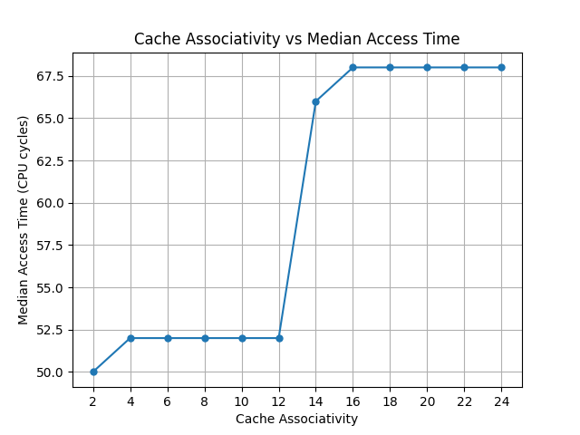

# Cache Associativity Detection Tool

## Description
This is a micro-benchmarking tool that detects the associativites of the L1, L2, and L3 caches. 

## Limitation 
The L3 results should not be used as an accurate predictor of the associativity of L3. The access times calculated in this implementation do not align with the expected values, which make the prediction not credible. The results of L1 and L2 vary from test to test, and often require a warm up test to produce accurate predictions. The implemenation limits the testing options to only x86 machines. 

## Usage
1. Navigate to the **src** directory
2. Create the virtual environment:  `python3 -m venv cacheassociativity_venv`
3. Activate the virtual environment: `source cacheassociativity_venv/bin/activate` 
4. Install the required dependencies: `pip3 install -r requirements.txt`
5. Run the provided *Makefile* to compile the C programs: `make all`
6. Run the python script, this will store the outputs in csv files\, generate the graph and print predictions: `python3 cache_associativity_benchmark.py`

### Note
Running the executables will create the csv files, and the python script will read and analyze that data to create the prediction. Additionally, the python file defaults to running the L1, L2, and L3 tests sequentially, this can be changed in the main function. Laslty, the test requires user input to run the test accuratly, so for best results use the system's true specifications.

## Example Graph

The following graph was generated by running the program on a Windows computer with an L1 associativity of 12.

*Figure 1: Windows machine with L1 associativity 12.*

