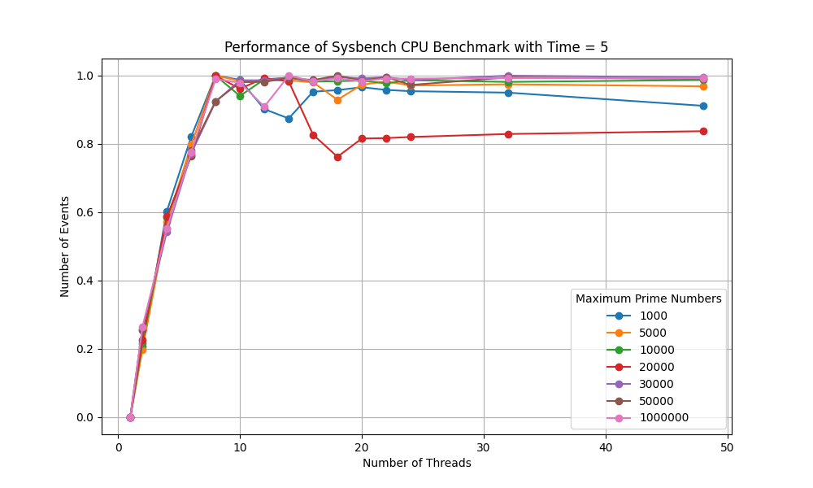
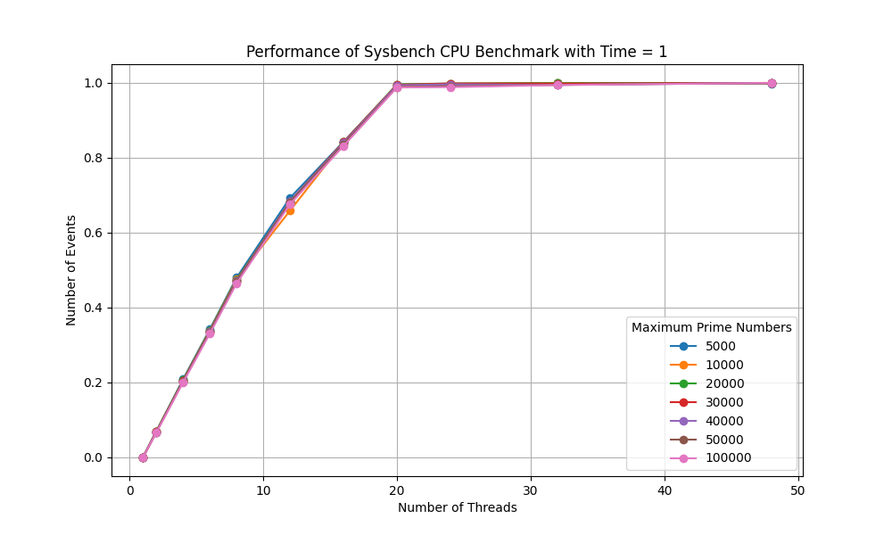
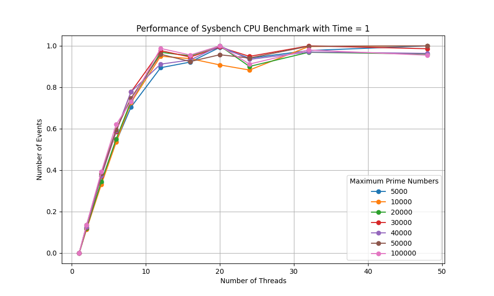
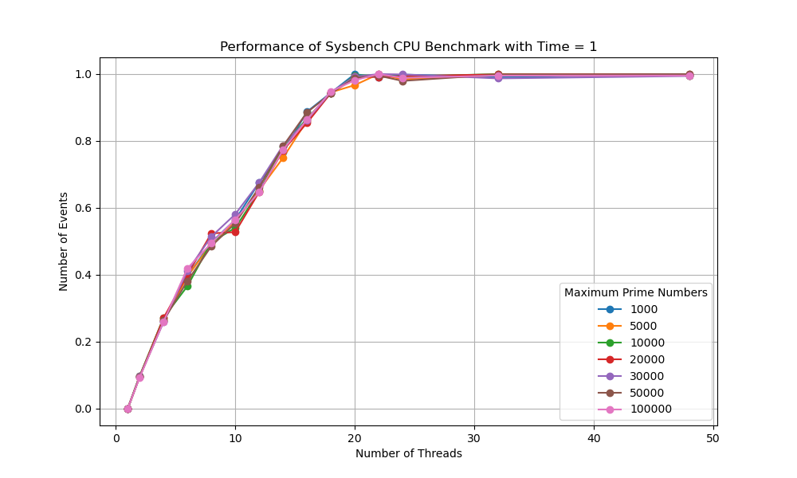
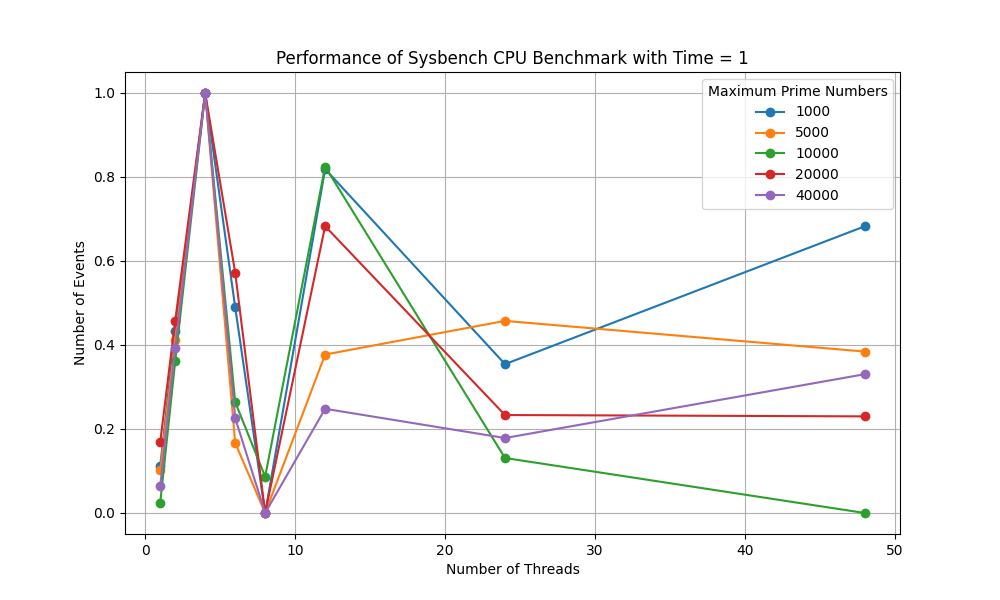
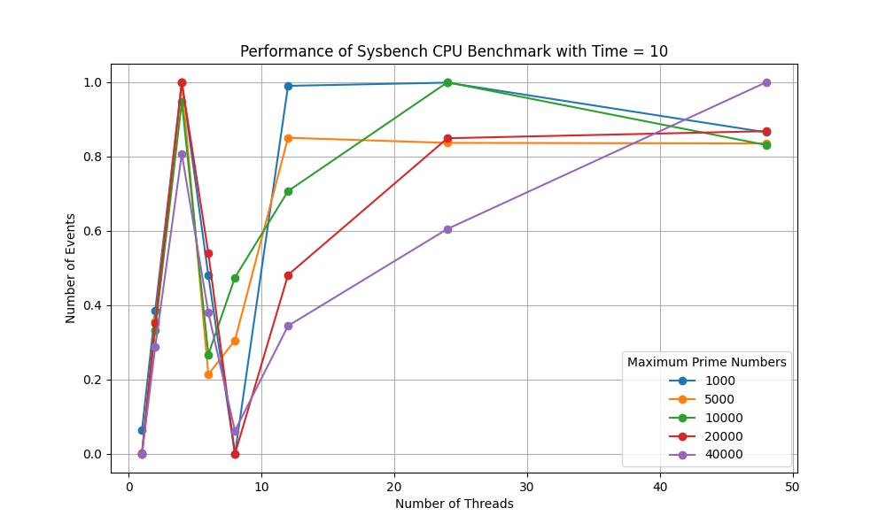

# Virtual Core Identification With Sysbench

## Description
This is a simple scripting program utilizing the cpu test of the *sysbench* tool and a piecewise linear regression model to detect the number of virtual cores on a computer system. Here, we define virtual cores to be the *processing units* available to the OS. It is an observed phenomenon that a computer system runs the benchmark at its full potential when the parameter *threads* is set equal to the number of virtual cores (the output when running the command *nproc --all*). This pattern allows this program to determine the number of virtual cores in a system with the following steps:

- Obtaining the output as the number of events from *sysbench cpu --cpu-max-prime={num_prime} run --num-threads={thread_count}* with different cpu-max-prime and num-threads
- A 2-segment linear regression is applied for each set of data (grouped by cpu-max-prime, each color line on the graph) in order to calculate the *breakpoint* (the x-value of the intersection between 2 linear lines) which happens to be the number of threads.
- By default, there are 5 cases with varying *cpu-max-prime* arguments returning 5 results. The mode of those results is reported as the final answer.

## Limitation

The program has been tested on 2 Linux computer, 2 Window machines with WSL and 2 MacOS device. So far the result has been accurate with high level of confidence except in the following conditions:

- The machine is not running the program at full performance mode
- The cpu becomes too hot
- Memory is full
- Program is run on Apple's M* chip

## Usage

The program is expected to run on Unix/Unix-like OS or Window with WSL. It is assumed that the system has [sysbench](https://github.com/akopytov/sysbench) installed. 

### Manual Setup

1. Create the virtual environment: *python3 -m venv myenv*
2. Activate the virtual environment: *source myenv/bin/activate*
3. Install the required dependencies: *pip3 install -r requirements.txt*
4. Run the script: *python3 threadcount.py*

### Automatic Setup

Run the provided script to automatically set up and activate the Python virtual environment: *./threadbenchmark.sh*

*Note: this is the preferred way of running the script, if not work please follow the manual setup instructions*

### Options

To modify the program to cater for specific use case, please head to *config.toml* for more details. In total, *sysbench* is run (*thread_count * prime_number*) times, each at *max_time* second. Here, there are three array parameters to change:

- *thread_count*: different number of virtual cores to test (extend this array for high-performance computer system)
- *prime_number*: different number limit for Prime Number Algorithm used in cpu test. The test will iteratively test if a number is prime from 3 to *prime_number* (extending this array creates more colored line in the graph) 
- *max_time*: time it takes to run each *sysbench* command

## Experimentation Result

The following graphs are generated by running the program.

### Correct Instances ✅

*Figure 1: Linux machine with Intel 4/8 CPU.*

*Figure 2: Linux machine with Intel 10/20 CPU.*

*Figure 3: Window machine (WSL) with Intel 6/12 CPU.*

*Figure 4: MacOS machine with Intel 6/12 CPU.*

### Incorrect Instances ❌

*Figure 5: Window machine (WSL) with Intel 10/20 CPU. Very close to correct answer, perhaps because small increase in performance is hardly noticeable* 

*Figure 6: MacOS machine with Apple M1 CPU (4 Power + 4 Efficiency) at different max_time. Incorrect answer but exhibited very pecular pattern when reaches maximum number of power cores.*