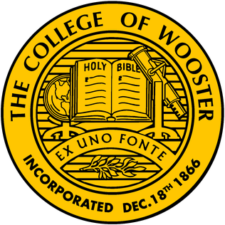
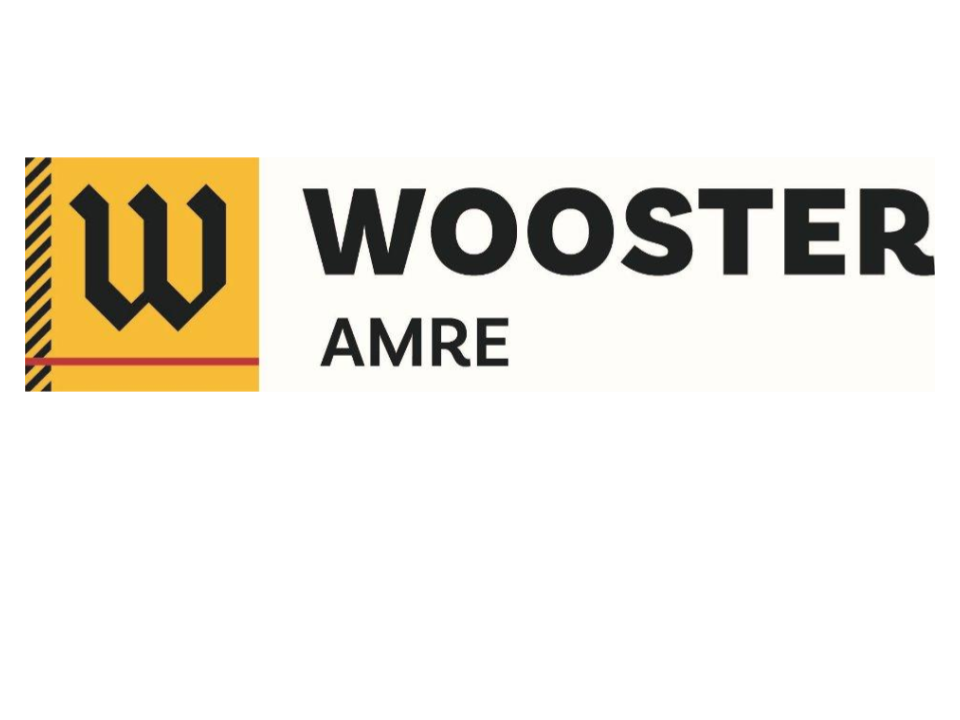
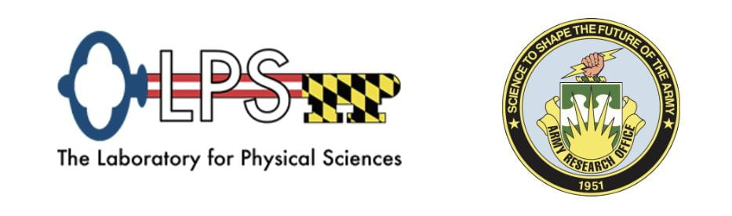

# Computer Hardware Analysis for Automated System Modeling (CHA2SM)

This project is part of the [College of Wooster](https://wooster.edu/)'s 2024 [AMRE](https://inside.wooster.edu/amre/) (Applied Method and Research Experience) Program working for the [Laboratory for Physical Science](https://www.lps.umd.edu/) of the University of Maryland. 

To assist with the process of automated system modeling, this work develops a series of microbenchmark that detects the following hardware parameters:

1. Number of Virtual Cores
2. Cache Line Size
3. Cache L3 Size
4. Cache Associativity

The details of these programs can be found in their respective folders. 

## Contributors

A three person team manages the development of this project:

1. Huy Phan, Class of 2026, College of Wooster, hphan26@wooster.edu
2. Jonathan Rueffer, Class of 2026, College of Wooster, jrueffer26@wooster.edu
3. Christ Lin, Class of 2026, College of Wooster, clin26@wooster.edu

## Acknowledgement

Special thanks to [Dr. Robert Kelvey](https://www.linkedin.com/in/robert-kelvey-5645a9172/) and [Dr. Nathan Sommer](https://www.linkedin.com/in/nathan-sommer-a61980110/) along with the wonderful LPS team of [Morgan Krommer](https://www.linkedin.com/in/morgan-kromer-753961255/),[Peyman Barakhshan](https://www.linkedin.com/in/dr-peyman-barakhshan-8b18b595/), [Shelby Coppolino](https://www.linkedin.com/in/shelby-coppolino-31003011b/), and [Dr. Brian Page](https://www.linkedin.com/in/brian-a-page/) for all the help and assistance along the journey. 

