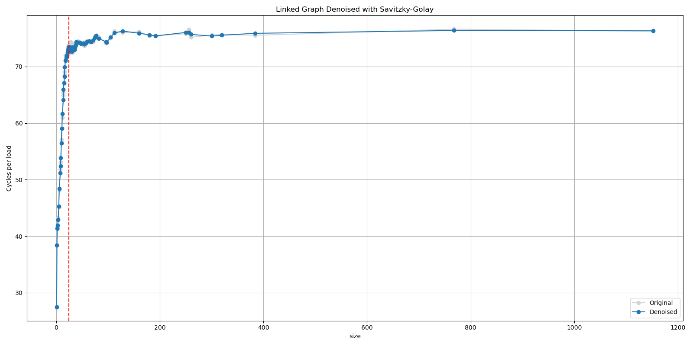

# L3 Cache Size Detection Tool

## Description
This repository contains two benchmarking tools for detecting and a python script for analyzing cache sizes. The main program performs benchmarks to determine the maximum cache size and estimates the L3 cache size. 
The main idea of the benchmarking tools is gradually increases the amount of data loaded into the cache while observing the read access times across four iterations to identify cache misses. Also the python program includes various methods for denoising data and visualizing results. Its primary objective is to detect the cache size for each level. Originally, it can detect cache sizes ranging from 64 KB to 1152 MB. However, due to the sensitivity of the cache, it can only estimate the L3 cache size with an error margin of approximately 1 MB, while L1d and L2 are inconsistent, so they are not estimated by the Python script. More details about this work can be found in the final paper report.

## Limitation 
Due to limited experimentation facilities, it has only been tested on a select collection of machine. In order to be eligible for actual use, future modifications must be considered.
Also, note that due to the sensitivity of how caches work, it is better to close all other background programs to run the test and run the python script serveral times. 

## Usage
1. Navigate the **src** directory
2. Create the virtual environment: `python3 -m venv cachesize_venv`
3. Activate the virtual environment: `source cachesize_venv/bin/activate`
4. Install the required dependencies: `pip3 install -r requirements.txt`  
5. Run the provided *Makefile* to compile the C++ programs: `make all`
6. Please check if the three header files *basetypes.h, polynomial.h, timecounters.h* are placed in the same directory with the cpp file.
7. Run the Python script 'python3 Final_Analyzing_Tool.py', and follow the on-screen instructions:
   - You will be prompted to enter the cache line size (default is 64).
   - You will be asked if you know the maximum cache size. If not, the program will run a benchmark to determine it.

## Output
The python program generates CSV files with benchmark data and visualizations of cache size detection results. These files are saved in the same directory as the script with timestamped filenames.

### Note
To facilitate modularity, the benchmark itself can be run alone using the C++ file or `make run`. It should be noted that it would only print the measurements to the stdout in csv format, the actual calculation and prediction are done with *Final_Analyzing_Tool.py*

## Example
1
Please enter the cache line size (default is 64): 
Do you know how big your biggest cache size is? (Y/N): n (case not sensitive)
Running Maximum Cache Size Detection Benchmark. Should take 10-20 minutes: 

Based on the SG smoothing with Kneedle Algorithm, your biggest Cache Size should not exceed:  24.75
Running L3 Cache Size Detection Benchmark. Should take 30 mins - 2 hours: 

Raw Data:
Your total cache size based on the piecewise regression is within the interval in MB: [23.12, 25.12]
Denoising Method KNN :
Your total cache size based on the piecewise regression is within the interval in MB: [23.15, 25.15]

2
Please enter the cache line size (default is 64): 64
Do you know how big your biggest cache size is? (Y/N): y
Please enter the max cache size in MB, please add 4MB to your assumption: 28
Running L3 Cache Size Detection Benchmark. Should take 30 mins - 2 hours: 
...

## Example Graph
The following graph are generated by running the program on a 24 MB L3 cache size computer.

* Simple Testing: The red dotted line refers to the maximum cache size you could have.*

* Detail Testing: Your L3 cache size should lie within the two green dotted line.*

## Files
*Final_Analyzing_Tool.py*: Main Python script for running the benchmarks and analyzing data.
*requirements.txt*: List of required dependencies.
*cachesize_estimated.cpp*: The benchmarking tool for detail testing the cache sizes.
*cachesize_maximum.cpp*: The benchmarking tool for simple testing the cache sizes.
*basetypes.h, polynomial.h, timecounters.h*: Header files that needed to run the cpp program.
*cache_L3size_benchmark_data_maximum_YYYY-MM-DD_HH-MM-SS.csv*: CSV file with maximum cache size benchmark data.
*cache_L3size_benchmark_data_estimated_YYYY-MM-DD_HH-MM-SS.csv*: CSV file with estimated L3 cache size benchmark data.
*Linked Graph Savitzky-Golay Maximum Cache Size.png*: Visualization of maximum cache size detection using denoised data by Savitzky-Golay filtering.
*Linked Graph KNN estimated_L3_size.png*: Visualization of estimated L3 cache size detection using denoised data by K-Nearest Neighbors.
*Linked Graph Raw estimated_L3_size.png*: Visualization of estimated L3 cache size detection using raw data.
